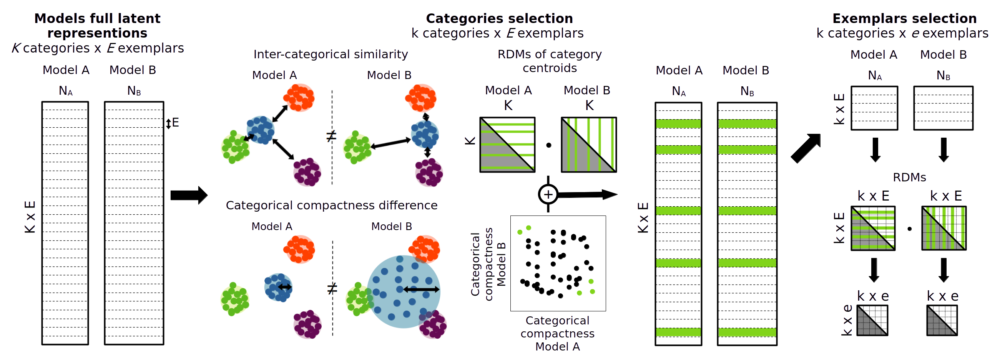

# A repository for the representational screening framework to stimuli curation

This is a stand-alone repository to facilitate the use of our recently developped representational screening approach for curating stimuli.  
The resulting stimuli help expose divergences between models, but also enable interpretable, and theory-driven behavioral and neuroimaging experiments.

The approach is in two stages:
 - First: We apply a screening procedure to select an arbitrarily small set of categories (default 12) that are found to be represented differently in two models.
 - Second: We apply a screening procedure to select a small set of stimuli that maximize divergence between models, quantified using a compactness metric derived from model representational geometries. Code to run the screening algorithm is made available below.  

Our approach can be applied to any pair of deep vision models. We tested multiple comparisons, and found that the approach reliably yielded interpretable and experiment ready “controversial” images that exposed differences in model representations. 

Collaborators: Leonard van Dyck, Alban Flachot (shared first authorship) and Katharina Dobs.

Van Dyck, L., Flachot, A. and Dobs, K. (in preparation) Model-guided stimulus curation for comparing artificial and biological vision.

## Requirements:

requirements.txt

## GenSet: a stimulus pool 

We generated a large-scale, category-structured image dataset (GenSet) using a latent diffusion model, balancing experimental control with natural appearance.  
GenSet was based on the test set of EcoSet and includes 565 categories and 28250 images.  
A link for downloading GenSet will be made upon acceptance.

## Representational screening

We assume here that you have two sets of model representations ready, one for each model of interest.  
In our case, the sets typically consisted of the set of activations in the penultimate layer of two models (e.g. ResNet) for the whole GenSet.  
But the screening methods works for any dataset, as long as it can equally be divided into categories.

### Activations

Two sets of activations are required. Each are expected to be saved in data/ in a seperate directory, under the name of the corresponding model.  
In the same directory need to be saved the images used when saving the activations, in order of presentation.

### Running the screening algorithm

The screening method can be found in representational_screening,py.  
To run it with the desired parameters, check out bash.py and modify accordingly.  
Then run bash.py

### Running some analysis

representational screening.py ouputs the final curated stimuli and the resulting 2 RDMs with their similarity.
To run further analysis, such as the kind found in the paper, we also provide the notebook analysis.ipynb

